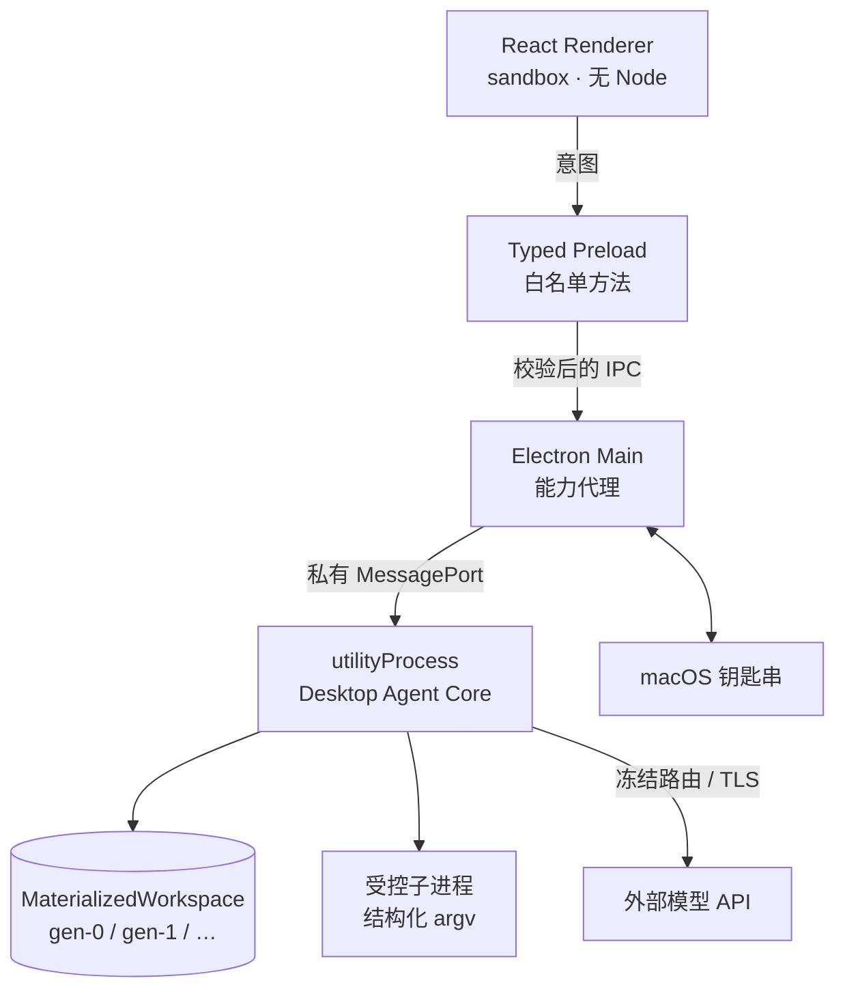

# RepoPilot

一个能自己改代码的 macOS 桌面 Agent —— 但**每一步都要能被审计、能被拒绝**。

它接管的闭环是：

```
授权本地仓库 → 结构化任务 → 只读理解仓库 → 出计划 → 你批准
→ 在隔离副本里改代码 → 跑真实 build/test → 有界自修复
→ diff + 未验证项 → 你接受或拒绝 → 导出补丁 / 应用回仓库
```

> **定位：产品种子（2026-08-27 自「可丢弃 spike」升格）。**
> 它真的能跑通上面这条链路，方向是长成真正可用的 Agent IDE —— 不另起炉灶，
> 在既有权威层与测试资产上继续长。但它**还不是**生产就绪的产品：
> 没有容器级沙箱、没有持久化加密、没有可续跑的崩溃恢复（见「还没做的」）。

## 它跟别的 coding agent 有什么不一样

大多数 coding agent 优化的是「尽量帮你改成功」。这个原型优化的是
**「别让它假装成功」**，为此刻意牺牲了一些便利：

| 别处常见做法 | 这里的做法 |
|---|---|
| edit 找不到就模糊匹配 | 命中 0 次或多次 → 整笔失败，绝不猜 |
| write 隐式覆盖 / 创建 | `CREATE_FILE` 撞到已有文件直接拒绝 |
| 模型说「构建通过了」 | 只认真实退出码，且必须先跑基线做对比 |
| 一个布尔值表示成功 | 判别联合：`EXIT_ZERO / EXIT_NONZERO / SIGNAL / TIMEOUT / CANCELLED / SPAWN_ERROR` |
| 直接在你仓库里改 | 改动只发生在隔离副本，宿主仓库全程只读 |
| 接受即成功 | 有验证 → `SUCCEEDED`；没验证 → `ACCEPTED_UNVERIFIED` |

最后一条是整套设计的落脚点：**门禁可以全放开，但系统不能说谎。**

## 架构



权限划分刻意做得很硬：

- **Renderer** 没有 Node、文件系统、shell、密钥，也不持有 Run 终态
- **Preload** 只暴露白名单方法，**没有** 通用 `invoke(channel, ...)`
- **Main** 只做窗口、原生目录选择、钥匙串、子进程监督 —— **不持有业务权威**
- **Core** 是 Task/Run/Approval/Patch 的唯一权威，且不监听任何端口

## 界面：从三栏长成一个小 IDE

- **四栏布局**：Activity 侧栏 | 文件树 | 编辑器 | 对话与运行。对话恒居中，
  面板开关不跳列；全局状态只有状态栏一个家。
- **多标签只读编辑器**：文件单击预览（同一位置复用）、双击固定；补丁 diff 也是一种标签，
  可与现状代码并排对照。编辑器刻意是**查看器** —— 用户手改要走哪条权威路径还没设计，
  不先斩后奏。
- **⌘K 命令面板**：动作 / 运行 / 项目 / 文件四组来源，按「此刻做得到」过滤，
  全部复用既有状态与 IPC，不新增权威。
- **键盘贯通**（PRD-NFR-ACC-001）：Esc 关层、F6 面板循环、树与列表方向键；
  焦点不进看不见的地方。
- **时间线**：相位锚点分章节，终端输出超限折叠并报剩余行数 —— 省略必须报数。

## 跑起来

```bash
cd prototype && pnpm install && pnpm rebuild electron
```

> 国内网络下载 Electron 二进制可能失败，加镜像：
> `ELECTRON_MIRROR=https://npmmirror.com/mirrors/electron/ pnpm rebuild electron`

```bash
pnpm dev
```

然后在「⚙ 设置 · API」里填任意一家的 API Key，**填完即生效，不用重启**。
内置 12 家：Anthropic、OpenAI、DeepSeek、Moonshot、智谱、阿里百炼、火山方舟、
硅基流动、魔搭、OpenRouter、AIHubMix、xAI；也能自己加任意 OpenAI / Anthropic
兼容端点。凭据由 macOS 钥匙串加密保管，界面只显示末四位。

`prototype/fixtures/vite-react-broken` 是一个自带真实构建错误的仓库，
可以直接拿它当第一个任务目标。

```bash
pnpm test        # 63 个文件 / 1147 个测试，含真实 tsc + vite build 的端到端链路
pnpm selftest    # 三进程 + 私有 IPC + Renderer 挂载的启动自检
```

## 有机器证据支撑的部分

`pnpm test` 的断言里，值得单独说的：

- exact-span 命中 0 次 / 多次 → 拒绝，且**工作区逐字节不变**
- 批次中任一 operation 失败 → 整批零写入
- 绝对路径 / `..` / symlink / 受保护路径全部 fail-closed
- 基线失败必须是真的 `TS2345`，不是 spawn 失败伪装的
- 修复后必须是真的 `EXIT_ZERO`
- 补丁 diff 里不含宿主绝对路径
- 补丁应用：目标文件已漂移 → `git apply --check` 拒绝，宿主逐字节不变
- 补丁写回宿主仓库要求**已被接受** + digest 匹配，门禁在 Core 不在界面
- 规划阶段与交叉审核阶段的只读由**平台强制**：模型点名写工具会被 `PHASE_READONLY` 拒绝
- 子进程 env 走白名单：仓库脚本拿不到 `ANTHROPIC_API_KEY` 之类的凭据
- macOS 上 `Package.json` 这类大小写变体不能绕过受保护路径
- **修复全程宿主仓库 `git status` 干净**
- 补丁触碰验证输入（配置 / 测试 / 验证脚本）→ `COVERAGE_WEAKENED`，接受只能是
  `ACCEPTED_UNVERIFIED` —— false-green 最短路径封口
- 「要求修改」开新 Attempt：旧补丁进 `priorPatches`、预算接着用，不是终态
- 交叉审核有界收敛：2 审 + 1 整改的硬上限写成直线，跨循环只能由人授权续期；
  「没给出结论」≠「通过」，`INCONCLUSIVE` 不折成绿灯
- 外部 CLI 真子进程隔离：synthetic HOME、整份替换的环境、无显式凭据拒绝启动；
  同厂商审核 `SAME_VENDOR_REVIEW_DENIED`
- 外部作者「写完了」= 退出码 + 平台 tree diff；candidate 归一化后走同一套
  mutation 门禁，失败路径主线逐字节不变
- 手填验证命令先分级（R1–R4）；未知二进制走一次性精确批准 —— 绑整条 argv、
  15 分钟 TTL、一张票只进一个 Run，批准不洗白风险等级
- eval：case 不声明可修改范围就拒绝加载，范围逐字进 `task.create`；
  B 臂审核方被降级 → 观察作废，绝不密封成 B 臂结果

## 一写一审：交叉审核与外部 CLI

补丁封存后，可以让**第二个异构模型**只读审一遍，产出结构化发现（severity /
confidence / file / range / evidence / blocking）。审核方由平台强制只读，
拿不到写工具；同厂商审核直接拒绝 —— 异构是不变式，不是披露项。

循环是有界的：每循环最多 **2 次审核 + 1 次针对性整改**，有阻断发现就整改、重验、
重封存，**不管 verdict 写的是什么**；不收敛时只能由你授权再跑一轮，
平台绝不自己「再试一次」。

写手和审核方各有多种形态，产品动态探测，不假设你装了什么：

- **多供应商模型 API**（推荐）：两家 key 就能跑异构一写一审；
- **本机 CLI**（`claude` / `codex`，含 .app 内打包的那份）：跑在一次性 synthetic HOME
  里，看不到你的登录态、`~/.claude` 和宿主凭据；无显式凭据拒绝启动；
- 外部 CLI 也能**当写手**（CANDIDATE_AUTHOR）：只在导出的一次性 candidate 目录里改，
  「写完了」的唯一判据是子进程退出 + 平台 tree diff，差异归一化后走同一套
  receipt / CAS / 受保护路径门禁，删除与二进制整笔拒绝。

必须说清楚的两件事：

- 审核方说「通过」**不等于**验证通过，也**不等于**可以接受。是否接受仍然只由你决定。
- 外部 CLI 这条路是 P1 合同（external-coding-agent-cross-review）的
  **可丢弃 spike 子集**，不是那份合同的实现：没有 connector 评审流程、
  terms/版本准入、network manifest 与资源/热治理。合同状态仍是 `P1_DEFERRED`，
  不因为原型跑通了就改。

## 证据与评测（SPK-010）

- **跨 Run 证据聚合**：指标层只投影平台已封存的事实，不产生新事实；北极星与漏斗
  强制同产出（反美化条款在类型层），算不出的指标进 `notComputable` 点名，不编数。
- **sealed A/B 实验 harness**：同一内容寻址 case 跑「单写」与「一写一审」两臂，
  臂完整性 fail-closed，盲评包不破盲；machine pass 只有一个裁决点 —— 未计分必须
  给出封闭枚举的 reason，改验证脚本骗绿不计分。
- **案例集 20/20**：2 个 seed + 18 个按故障类型铺开（语法 / 类型合同 / 模块依赖 /
  测试稳定性 / 配置约定 / 行为，外加 2 个范围/安全负样本 —— 其一在允许范围内
  **不可修复**，绿灯的两条路都被范围合同挡死）。每个 case 都有机械的
  基线红 / 参考修复绿证据，参考修复不进 case 目录。这些是零依赖、秒级验证的
  确定性任务，**不是**真实 Vite/React/TS 工具链 fixture（那是正式 benchmark
  未解冻的 blocker）。
- **执行入口**：`pnpm eval:spk010 -- --implementer <provider> --reviewer <provider>`
  —— 预检（路由 / 默认模型 / 凭据就绪度）、`--dry-run` 零出站、断点续跑、连续失败熔断，
  收口落 `ab-report.json` 与盲评包。凭据只从环境变量读，脚本不接受明文 key。
- **诚实边界**：样本门槛已达、执行入口就绪，但正式实验（真实模型 + 人工盲评）
  **还没有跑**。harness 建成 ≠ 实验做完，「一写一审值不值」仍是 Open。

## 还没做的

- **隔离强度**：`utilityProcess` + 子进程**不是**容器沙箱。`node_modules` 目前是宿主的
  symlink，构建脚本以你的用户权限运行。这是明确接受的残余风险。
- **持久化加密**：Run 事件是 JSONL，没有加密。（分级保留与清理已经做了：
  工作区终态后 60 分钟回收、证据 30 天、快照与 artifact 按引用计数；
  保留策略在设置页可见、可改。）
- **崩溃恢复**：重启后历史可读、被打断的 Run 落 `INTERRUPTED`；但**不含**带 hash 校验、
  fail-closed 的可续跑 Checkpoint。
- **多轮对话**：对话流目前是只读投影，不能在运行中追加指令。
- **编辑器写路径**：编辑器目前是查看器；用户手改如何走权威（receipt / CAS / 审计）
  还没设计。
- **SPK-010 正式实验**：案例集已 20/20，但真实模型 pilot 与人工盲评未跑（需另行授权）。
- **外部 CLI 的合同化治理**：connector 评审流程、terms/版本准入、network manifest、
  资源/热治理都没有 —— 现状是 spike 子集。

## 开发记录

[`docs/devlog/`](docs/devlog/) 按天记录设计取舍和踩过的坑，目前 **61 篇**，
完整索引见 [devlog/README.md](docs/devlog/README.md)。几篇有代表性的：

| 篇 | 主题 |
|---|---|
| [08-07-01](docs/devlog/2026-08-07-01-给agent做ide的三进程架构.md) | 给 Agent 做 IDE：三个进程怎么切权限 |
| [08-07-03](docs/devlog/2026-08-07-03-怎么不让agent假装成功.md) | 怎么让 Agent 没法假装自己成功了 |
| [08-09-01](docs/devlog/2026-08-09-01-389个测试全绿而产品跑不通.md) | 389 个测试全绿，而产品跑不通 |
| [08-19-05](docs/devlog/2026-08-19-05-作者说写完了不算目录差异才算.md) | 作者说「写完了」不算，目录差异才算 |
| [08-24-02](docs/devlog/2026-08-24-02-被降级的B臂不是B臂.md) | 被降级的 B 臂，不是 B 臂 |
| [08-26-13](docs/devlog/2026-08-26-13-一句抱怨十二个切片.md) | 一句抱怨，十二个切片 |

## 致谢

Provider 注册表、key 解析优先级、base URL 覆盖等设计参考了
[neovate-code](https://github.com/neovateai/neovate-code)，
细节对照见 [devlog 05](docs/devlog/2026-08-07-05-接入十二家模型api.md)。
其中「API key 明文写进配置文件」一处**没有**照搬，改用了系统钥匙串。

## License

[MIT](LICENSE)
