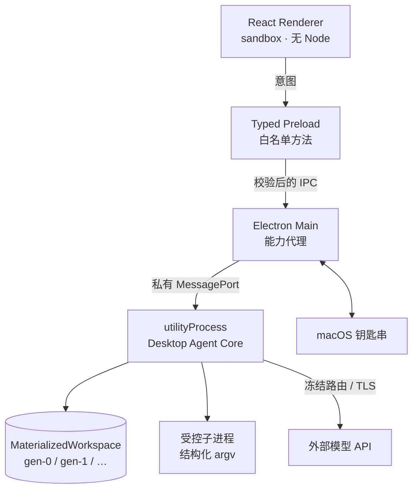

# RepoPilot

一个能自己改代码的 macOS 桌面 Agent —— 但**每一步都要能被审计、能被拒绝**。

它接管的闭环是：

```
授权本地仓库 → 结构化任务 → 只读理解仓库 → 出计划 → 你批准
→ 在隔离副本里改代码 → 跑真实 build/test → 有界自修复
→ diff + 未验证项 → 你接受或拒绝 → 导出补丁 / 应用回仓库
```

> **定位：可丢弃的工程原型（disposable spike）。**
> 它能真的跑通上面这条链路，但不是生产就绪的产品。不做隔离沙箱、不做数据加密、
> 不做崩溃恢复。它存在的目的是验证一组设计假设，不是给你日常用。

## 它跟别的 coding agent 有什么不一样

大多数 coding agent 优化的是「尽量帮你改成功」。这个原型优化的是
**「别让它假装成功」**，为此刻意牺牲了一些便利：

| 别处常见做法 | 这里的做法 |
|---|---|
| edit 找不到就模糊匹配 | 命中 0 次或多次 → 整笔失败，绝不猜 |
| write 隐式覆盖 / 创建 | `CREATE_FILE` 撞到已有文件直接拒绝 |
| 模型说「构建通过了」 | 只认真实退出码，且必须先跑基线做对比 |
| 一个布尔值表示成功 | 判别联合：`EXIT_ZERO / EXIT_NONZERO / SIGNAL / TIMEOUT / CANCELLED / SPAWN_ERROR` |
| 直接在你仓库里改 | 改动只发生在隔离副本，宿主仓库全程只读 |
| 接受即成功 | 有验证 → `SUCCEEDED`；没验证 → `ACCEPTED_UNVERIFIED` |

最后一条是整套设计的落脚点：**门禁可以全放开，但系统不能说谎。**

## 架构



权限划分刻意做得很硬：

- **Renderer** 没有 Node、文件系统、shell、密钥，也不持有 Run 终态
- **Preload** 只暴露白名单方法，**没有** 通用 `invoke(channel, ...)`
- **Main** 只做窗口、原生目录选择、钥匙串、子进程监督 —— **不持有业务权威**
- **Core** 是 Task/Run/Approval/Patch 的唯一权威，且不监听任何端口

## 跑起来

```bash
cd prototype && pnpm install && pnpm rebuild electron
```

> 国内网络下载 Electron 二进制可能失败，加镜像：
> `ELECTRON_MIRROR=https://npmmirror.com/mirrors/electron/ pnpm rebuild electron`

```bash
pnpm dev
```

然后在「⚙ 设置 · API」里填任意一家的 API Key，**填完即生效，不用重启**。
内置 12 家：Anthropic、OpenAI、DeepSeek、Moonshot、智谱、阿里百炼、火山方舟、
硅基流动、魔搭、OpenRouter、AIHubMix、xAI；也能自己加任意 OpenAI / Anthropic
兼容端点。凭据由 macOS 钥匙串加密保管，界面只显示末四位。

`prototype/fixtures/vite-react-broken` 是一个自带真实构建错误的仓库，
可以直接拿它当第一个任务目标。

```bash
pnpm test        # 463 个测试，含一条跑真实 tsc + vite build 的端到端链路
pnpm selftest    # 三进程 + 私有 IPC + Renderer 挂载的启动自检
```

## 有机器证据支撑的部分

`pnpm test` 的断言里，值得单独说的：

- exact-span 命中 0 次 / 多次 → 拒绝，且**工作区逐字节不变**
- 批次中任一 operation 失败 → 整批零写入
- 绝对路径 / `..` / symlink / 受保护路径全部 fail-closed
- 基线失败必须是真的 `TS2345`，不是 spawn 失败伪装的
- 修复后必须是真的 `EXIT_ZERO`
- 补丁 diff 里不含宿主绝对路径
- 补丁应用：目标文件已漂移 → `git apply --check` 拒绝，宿主逐字节不变
- 补丁写回宿主仓库要求**已被接受** + digest 匹配，门禁在 Core 不在界面
- 规划阶段与交叉审核阶段的只读由**平台强制**：模型点名写工具会被 `PHASE_READONLY` 拒绝
- 子进程 env 走白名单：仓库脚本拿不到 `ANTHROPIC_API_KEY` 之类的凭据
- macOS 上 `Package.json` 这类大小写变体不能绕过受保护路径
- **修复全程宿主仓库 `git status` 干净**

## 交叉审核（第二个模型）

补丁封存后，可以让**另一个模型 API** 只读审一遍，产出结构化发现（severity /
confidence / file / range / evidence / blocking）。审核方由平台强制只读，
拿不到写工具。

必须说清楚的两件事：

- 审核方说"通过"**不等于**验证通过，也**不等于**可以接受。是否接受仍然只由你决定。
- 这里用的是两个 `ModelConnectionProfile`，**不是** PRD 里定义的
  `ExternalCodingAgentConnectorProfile`。所以本项目**没有**接入 Codex CLI /
  Claude Code 这类自带 Agent Loop 的外部编码代理，只是"第二个模型 API 交叉审核"。

## 还没做的

- **隔离强度**：`utilityProcess` + 子进程**不是**容器沙箱。`node_modules` 目前是宿主的
  symlink，构建脚本以你的用户权限运行。这是明确接受的残余风险。
- **持久化加密**：Run 事件是 JSONL，没有加密。（分级保留与清理已经做了：
  工作区终态后 60 分钟回收、证据 30 天、快照与 artifact 按引用计数。）
- **崩溃恢复**：重启后历史可读、被打断的 Run 落 `INTERRUPTED`；但**不含**带 hash 校验、
  fail-closed 的可续跑 Checkpoint。
- **保留策略的界面出口**：后端 IPC 就绪，设置页还没接出来 —— 用户目前看不到也改不了 30 天这回事。
- **交叉审核的自动整改**：目前只跑 1 轮审核就交回人工；PRD 允许的"1 次整改 + 第 2 轮审核"
  还没接线。
- **账本诚实性**：provider 不返回 usage 时记成 0（应记"未知"），失败的调用不入账。
- **多轮对话**：对话流目前是只读投影，不能在运行中追加指令。
- **「要求修改」**：点了只会 BLOCKED，不会带着反馈创建新 Attempt。

## 开发记录

[`docs/devlog/`](docs/devlog/) 按天记录了设计取舍和踩过的坑，每篇独立成文：

| 篇 | 主题 |
|---|---|
| [01](docs/devlog/2026-08-07-01-给agent做ide的三进程架构.md) | 给 Agent 做 IDE：三个进程怎么切权限 |
| [02](docs/devlog/2026-08-07-02-确定性mutation引擎.md) | 让 LLM 改代码，但不让它模糊匹配 |
| [03](docs/devlog/2026-08-07-03-怎么不让agent假装成功.md) | 怎么让 Agent 没法假装自己成功了 |
| [04](docs/devlog/2026-08-07-04-门禁设计的三次反转.md) | 一个门禁设计，我改了三次 |
| [05](docs/devlog/2026-08-07-05-接入十二家模型api.md) | 接十二家模型 API，抄一个开源 CLI 的设计 |

## 致谢

Provider 注册表、key 解析优先级、base URL 覆盖等设计参考了
[neovate-code](https://github.com/neovateai/neovate-code)，
细节对照见 [devlog 05](docs/devlog/2026-08-07-05-接入十二家模型api.md)。
其中「API key 明文写进配置文件」一处**没有**照搬，改用了系统钥匙串。

## License

[MIT](LICENSE)
