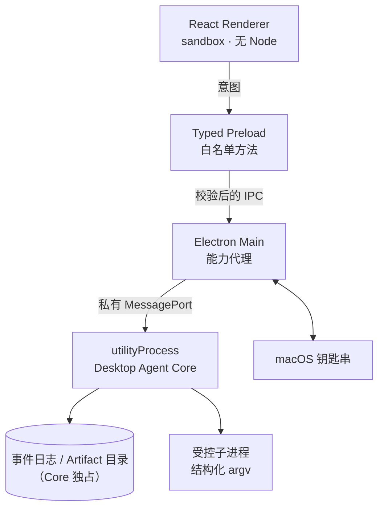

# 给 Agent 做 IDE：三个进程怎么切权限

> 开发记录 · 2026-08-07 · RepoPilot

做一个能自己改代码的桌面 Agent，第一个要想清楚的不是「怎么调模型」，
而是**谁有权力说「这次成功了」**。

想岔了会怎样：Renderer 里点一下按钮，前端 state 改成 `approved`，然后发个 IPC 让后台执行。
这套逻辑在普通 CRUD 应用里天天写，但放在这儿是致命的 —— 因为「批准」是一个
授权事实，它不能诞生在一个随时能被 devtools 改掉的地方。

## 先看一个反面样本

我们参考的开源 CLI（[neovate-code](https://github.com/neovateai/neovate-code)）里有这么一段：

```ts
// src/sdk.ts:304-338
// SDK 模式下，工具调用自动批准
```

以及子 Agent 在消息总线缺失时的处理：

```ts
// src/tools/task.ts:121-152
// bus 不可用 → fail-open，继续执行
```

这两处单独看都有理由：SDK 是给程序调的，没人能点确认；bus 挂了不该让整个流程崩。
但合起来的含义是：**「没人批准」和「批准了」在代码里走同一条路径。**

这不是那个项目做错了 —— 它是个 CLI 工具，用户就是操作者本人。
但如果要做成「能审计、能拒绝、能追责」的产品，这条路径必须堵死。

## 三个进程，三种权力



图里那个存储节点要表达的是**边界**：证据存储由 Core 独占，Renderer 和 Main 都碰不到。
至于用什么存，原型阶段是 JSONL + 未加密目录（`core/store.ts:13` 写着「原型用 JSONL；
overlay 的目标是 SQLite WAL 单 writer」，`core/paths.ts:7` 写着「原型阶段不做加密」）。
这条也在 README 的「还没做的」里 —— 别把图当成已实现清单。
注意凭据是另一回事：那条走 `M <--> K`，用 Electron safeStorage 落在钥匙串里。

权力划分：

| 进程 | 有什么 | **明确没有什么** |
|---|---|---|
| Renderer | 展示、收集输入 | Node、文件系统、shell、密钥、Run 终态 |
| Preload | 白名单方法、shape 校验 | 通用 `invoke`、业务授权、路径解析 |
| Main | 窗口、原生目录选择、钥匙串、监督 Core | **Task / Run / Approval 权威**、Agent Loop、仓库写权限 |
| Core | 唯一业务权威、Agent Loop、工具执行、Mutation | 长期明文凭据、任意宿主路径、监听端口 |

最反直觉的一条是 **Main 不持有业务权威**。Main 是主进程，什么都能干，
所以很容易变成一个大杂烩。这里刻意把它限制成「能力代理」：
它能弹出目录选择框（因为这是原生能力），但它不知道什么是 Run，也不能改 Run 的状态。

## Preload 长什么样

关键是**不暴露通用能力**：

```ts
const bridge: RepoPilotBridge = {
  protocolVersion: PROTOCOL_VERSION,

  request(method, payload) {
    return ipcRenderer.invoke(IPC_CHANNEL.request, {
      protocolVersion: PROTOCOL_VERSION,
      method,
      payload,
    });
  },

  subscribe(handler) { /* 只读事件订阅 */ },
};

contextBridge.exposeInMainWorld('repopilot', bridge);
```

注意这里**没有** `invoke(channel, ...args)`。Renderer 连 channel 名字都拿不到 ——
它只能调用 `request('run.cancel', {...})`，而 `'run.cancel'` 这个字符串必须在
Main 的白名单里：

```ts
const ALLOWED_METHODS = new Set([
  'doctor.run', 'project.pick', 'project.import',
  'task.create', 'run.cancel', 'approval.decide',
  // ...
]);
```

不在集合里的一律拒绝。这不是「多一层校验」，而是让「注册一个新的特权通道」
这件事必须改 Main 的源码，不能由插件、配置或运行时逻辑完成。

## 状态提交协议

```
1. Renderer 提交意图
2. Preload 做边界校验
3. Main 校验 sender + schema + 协议版本 + epoch，转交 Core
   —— Main 不先写任何业务事实
4. Core 在单事务里持久化 intent + expected version + 幂等键
5. Runtime / Model / Tool 子模块只能向 Core 返回 proposal 和 observation
6. Core 重验 schema、状态版本、lease、审批、预算后才提交状态和事件
```

第 3 步的「Main 不先写」很容易被忽略。一旦 Main 为了「快一点」先在本地记一笔，
就出现了两个真相源，crash 之后它俩会不一致。

## 踩的坑

### 坑 1：事件推送早于订阅

Core 启动完发 `ready`，Main 转发给 Renderer。但窗口创建是异步的 ——
如果 Core 比 window 先就绪，这条推送就发给了空气，UI 永远停在「Core 启动中」。

这个 bug 是**自检抓出来的**，不是我看代码看出来的。当时自检输出里
Renderer 文本是：

```
"RepoPilot prototype · Core 启动中 项目 + 授权本地仓库…"
```

明明 Core 已经 `ready` 了。修法很直白 —— 事件是「推」的，不能指望订阅方一定在场：

```ts
mainWindow.webContents.on('did-finish-load', () => {
  pushToRenderer({
    type: 'core.status',
    status: coreReady ? 'READY' : core ? 'RESTARTING' : 'DOWN',
    detail: coreReady ? 'Agent Core 已就绪' : 'Agent Core 尚未就绪',
  });
});
```

**任何「推送 + 订阅」的组合，都要问一句：订阅晚了怎么办。**

### 坑 2：Core 挂了，在途请求永远挂着

Core 是子进程，会崩。崩的时候 `pending` Map 里可能有十几个等着 resolve 的 Promise。
不处理的话，UI 上就是一堆转不完的圈。

```ts
child.on('exit', (code) => {
  coreReady = false;
  // 所有在途请求必须收到明确失败，不能永远挂着
  for (const [id, resolve] of pending) {
    pending.delete(id);
    resolve({
      ok: false,
      error: { code: 'CORE_UNAVAILABLE', message: 'Agent Core 已退出', detail: `exit code ${code}` },
    });
  }
  if (!quitting) setTimeout(startCore, 1000);
});
```

`if (!quitting)` 这个判断也是必须的，否则退出应用时会疯狂重启 Core。

### 坑 3：ESM 打包下的 `require`

Core 里图省事写了一句：

```ts
const { execFileSync } = require('node:child_process');
```

typecheck 过了，因为 `@types/node` 声明了 `require`。但 electron-vite 把 main
打成 ESM（`format: 'es'`），运行时 `require` 根本不存在。

**typecheck 通过 ≠ 能跑。** 这类问题只能靠真的启动一次来发现。

## 怎么证明它真的跑起来了

「启动没报错」不算证据。我加了一个自检模式，走**完全相同**的 Main → Core 通道：

```bash
REPOPILOT_SELFTEST=1 npx electron .
```

```
[selftest] Core 就绪，用时 106ms
[selftest] PASS doctor.run → {"checks":[{"checkId":"node","status":"READY",...
[selftest] PASS 未知方法被拒绝 → {"code":"BAD_REQUEST","message":"未知方法: run.deleteEverything"}
[selftest] PASS renderer 已挂载（root 子节点 1，preload bridge 存在）
[selftest] ALL PASS
```

最后一条尤其重要 —— 它在页面里执行了一小段 JS，确认 `#root` 真的有子节点、
`window.repopilot` 真的存在。「编译通过」和「React 挂上去了」是两回事。

## 可以带走的

1. **先想清楚「谁能宣布成功」，再想怎么调模型。** 权限边界定错了，后面全是补丁。
2. **主进程不是万能进程。** 它越像大杂烩，你越说不清授权发生在哪。
3. **不给通用能力。** 没有 `invoke(channel)`，就没有「意外多出来一个特权通道」。
4. **推送要考虑订阅晚到。** 加载完成时补发一次当前状态，成本极低。
5. **给自己写一个走真实通道的自检。** 它抓到的 bug 比读代码多。

---

下一篇：[让 LLM 改代码，但不让它模糊匹配](2026-08-07-02-确定性mutation引擎.md)
