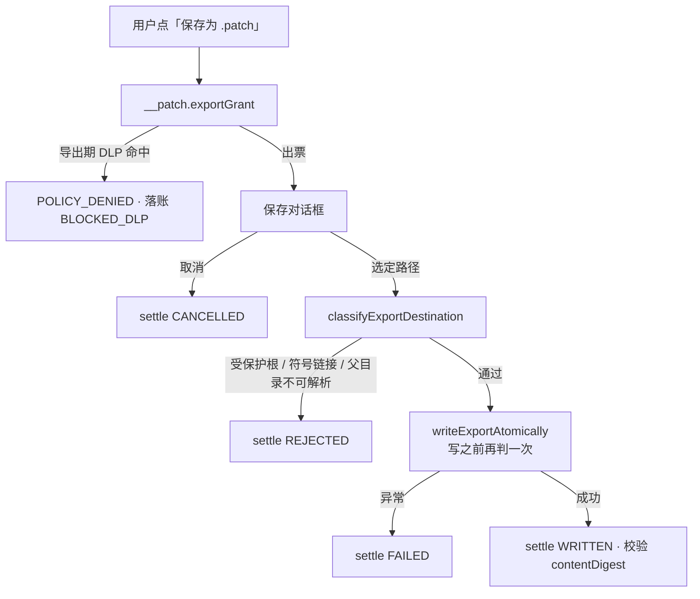

# 「另存为」是产品里最后一条没人管的写盘路径

「应用到仓库」我们守了三道闸：二次确认、`git apply --check` 干跑、冲突整笔拒绝。
旁边那个「保存为 `.patch`」按钮，主进程一句 `writeFileSync(chosen.filePath, content)` 就写完了。
Core 不知道这件事发生过，也没有机会说不。

## 问题是什么

08-17 那轮原型 × PRD/TD 一致性审计把它列成高危，理由不是"可能写坏文件"，
而是三个更具体的东西。改之前的代码长这样：

```ts
// main/index.ts（旧）
const content = await callCore('__patch.content', { runId, patchId });   // 拿全文
const chosen = await dialog.showSaveDialog(...);
if (!chosen.canceled) writeFileSync(chosen.filePath, content);           // 就这一句
```

**第一，主进程手上多了一份补丁全文。** `__patch.content` 是个"给我正文"的接口，
调用它不需要说明打算拿去干什么。有了它，主进程可以复制、可以写盘、可以写第二次、
可以在用户取消之后照写不误 —— Core 全程不知情，事件流里一个字都没有。

**第二，目的地没人判。** 保存对话框默认在下载目录，但用户完全可以点进正在被修的那个仓库。
`.patch` 一旦落在仓库里，下一次快照导入就会把它当成源码收进去 ——
"宿主仓库只读"这条不变式在那一刻已经破了，只是没人报警。
落进 RepoPilot 自己的数据根也一样：保留策略会把陌生文件当垃圾清掉。

**第三，写了一半的补丁看上去和完整的一样。** `writeFileSync` 中途失败（磁盘满、
U 盘拔了）会留下一个被截断的 `.patch`。它能打开、能读、`git apply` 会在某一行报错，
而用户会以为是补丁本身有问题。

## 怎么解决的

出一张票，而不是给一份正文。

```ts
// core/authority.ts
private issueExportGrant(runId: string, patchId: string): { grant: PatchExportGrant; content: string } {
  const content = renderPatchFile(record);

  // 导出期 DLP：这是补丁离开应用之前的最后一道
  const hits = scanSegments([{ text: content, where: `patch:${patchId}` }]);
  if (hits.length > 0) { /* 落账 BLOCKED_DLP，然后 POLICY_DENIED */ }

  const forbiddenRoots = [
    // 项目仓库本身：.patch 存进正在被修的仓库，下一次导入就会把它当源码收进快照
    ...(project ? [project.hostPath] : []),
    // 受管数据根（快照/工作区/证据/凭据都在里面）：保留策略会把陌生文件当垃圾清掉
    PATHS.root,
  ];

  const grant: PatchExportGrant = {
    grantId: newId('xgrant'),
    runId, patchId,
    patchDigest: record.patch.digest,
    contentDigest: digestOf({ content }),      // 落盘的字节要和这张票对得上
    filename: suggestPatchFilename(record),
    byteLength: Buffer.byteLength(content, 'utf8'),
    forbiddenRoots,                            // 由 Core 给，主进程不自己猜
    issuedAt: nowIso(),
    expiresAt: new Date(Date.now() + EXPORT_GRANT_TTL_MS).toISOString(),  // 5 分钟
  };
  this.exportGrants.set(grant.grantId, grant);
  return { grant, content };
}
```

`__patch.content` 删掉了。正文只随票一起出现，一次。

主进程那边变成一条有结局的流程 —— 四种结局都要回 `settle`：



目的地判定与原子落盘抽成了 `src/main/patchExport.ts`（168 行），理由和之前抽
`envelope.ts` 一样：这段逻辑长在 `main/index.ts` 里，而 `main/index.ts` 一被 import
就会拉起 Electron —— **最该被负向测试覆盖的一层，恰恰是测不到的那一层**。
抽出来之后 `patchExport.test.ts` 172 行、12 条用例，全是负向的。

判定里两个点值得单独说。

**比路径要先 realpath。** 只比字符串会被 `~/tmp -> /repo` 这种链接绕过，而这正是这道检查
要挡的东西。所以取父目录的 realpath 再拼回文件名去比：

```ts
const parentReal = realpathSync(dirname(absolute));
const resolved = join(parentReal, basenameOf(absolute));
```

**判定要跑两次。** 选完路径到真正写入之间有一个窗口，目标可以在这期间被换成符号链接。
所以 `writeExportAtomically` 的第一件事就是把判定再跑一遍，而不是信任调用方刚才判过：

```ts
export function writeExportAtomically(targetPath, content, forbiddenRoots) {
  const recheck = classifyExportDestination(targetPath, forbiddenRoots);   // TOCTOU
  if (!recheck.ok) throw new ExportDestinationError(recheck.reason, recheck.detail);
  ...
  const fd = openSync(tmpFile, 'wx', 0o600);   // 同目录临时文件，已存在即失败
  writeSync(fd, content, 0, 'utf8');
  closeSync(fd);
  renameSync(tmpFile, resolvedPath);           // 同文件系统上原子
}
```

临时文件建在**同一个目录**，不是 `/tmp` —— 跨文件系统的 `rename` 会退化成"复制 + 删除"，
原子性就没了。

一次性怎么保证：`settleExportGrant` 无论结局是什么，第一件事都是把票从表里删掉。
「选完路径又改主意」和「拿同一张票写第二个地方」于是都不可能。事件流里记的是**文件名**，
不是宿主绝对路径 —— 事件流是要给人看、也是要能导出的。

## 踩了什么坑

### 一、那条测试单独跑绿、一起跑红 —— 同一个坑，第二次

新加的 5 条授权语义 e2e，跑全量时挂了一条，20.5 秒超时；单独跑 640ms 通过。

这个形状我两天前刚写过一篇（[2026-08-20-02](2026-08-20-02-要求修改不该是终点.md)）：
用例结束时后台还有 Attempt 在推进，`fetch` 是全局 stub，
**上一条用例的后台 Run 会去喝下一条用例的模型脚本队列**，表现成"脚本已耗尽"。
修法是 `afterEach` 里 `authority.shutdown('test-teardown')`。

我当时只在出问题的那个文件里加了。这次一查：

```
authority.e2e.test.ts                   3
authority.external-author.e2e.test.ts   0
authority.coverage.e2e.test.ts          0
authority.egress.e2e.test.ts            0
authority.attempt.e2e.test.ts           1
```

五份 harness 是复制出来的，修的时候只修了一份。**复制出来的东西会各自漂移**，
而漂移出来的差异不会立刻变红 —— 它变成一颗地雷，等到下一个人往那个文件里加用例时才炸。
三份补齐，并在每份的注释里写清"这段在四份副本里都要有"。

### 二、把「原因枚举」直接甩给用户看

第一版渲染层直接显示 `r.reason`，于是用户看到的是：

> `FORBIDDEN_ROOT`：目标落在受保护目录内：/Users/…/my-repo

枚举值是给日志和统计用的封闭词表，不是给人看的。用户看到全大写下划线只会去猜。
补了一张标签表，每条都说清**下一步做什么**：

```ts
const EXPORT_REASON_LABEL: Record<string, string> = {
  FORBIDDEN_ROOT: '不能存到这里（项目仓库或 RepoPilot 数据目录内）',
  NOT_A_REGULAR_FILE: '目标不是普通文件（符号链接与目录都不覆盖）',
  UNRESOLVABLE: '目标所在目录无法解析',
  ...
};
```

`?? r.reason` 兜底 —— 将来加了新原因忘了配标签，显示的是枚举值而不是空白。
**少一条标签是难看，显示成空白是撒谎。**

### 三、`realpathSync` 不在 `node:path` 里

```
TypeError: realpathSync is not a function
```

测试里从 `node:path` import 了它。`path` 有 `resolve`、有 `normalize`，
唯独 `realpath` 在 `fs` —— 因为它要读磁盘。这个错误五秒就修好了，
但它顺带说明了一件事：**`resolve` 和 `realpath` 是两种东西**，
前者只做字符串运算，后者才解析链接。这道检查如果误用了前者，会安静地失效。

## 可复用的结论

- **给能力，不给原料。** `__patch.content` 这种"把正文给我"的接口，调用方拿到之后
  做了什么、做了几次，签发方一无所知。换成一张绑 digest、带 TTL、一次性的票，
  签发方就重新拿回了"这次导出算不算数"的话语权。
- **判定要贴着副作用跑。** 选路径与写文件之间的窗口足够换掉一个符号链接。
  把判定放进写函数的第一行，比在调用处判一次可靠。
- **临时文件必须和目标同目录。** 否则 `rename` 跨文件系统退化成复制 + 删除，
  你以为的原子性并不存在。
- **复制出来的测试脚手架会各自漂移。** 修了一份 harness 的坑，要去查其余几份 ——
  它们不会立刻变红，只会在下一个人加用例时炸。
- **枚举值不是文案。** 封闭词表给机器，标签表给人，兜底要落到枚举值而不是空白。

---

`pnpm test` 51 个文件 / 929 个测试全绿，`pnpm selftest` ALL PASS。
至此原型里**两条**会写用户磁盘的路径 —— 应用到仓库、导出补丁 —— 都在 Core 的账本上了。
