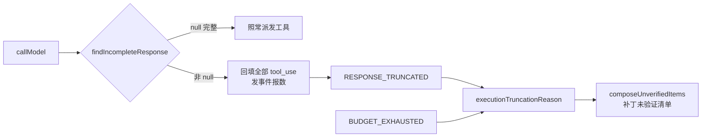

# 一个写进去没人读的字段

一份外部方案递过来，说我的 Agent 有五个可靠性缺陷，建议照 Pi 的做法修。
它引的是一个月前的提交。我拿本地源码逐条核了一遍：**五个里四个早就修了**，
剩下那个真缺陷的根因不是「少了一道门禁」，而是**一个字段被两个 adapter 老实写进去，
然后没有任何一行生产代码读它**。

## 一、问题是什么

`core/model/types.ts` 里有个 `StopReason`：

```ts
export type StopReason = 'TOOL_USE' | 'END_TURN' | 'MAX_TOKENS' | 'OTHER';
```

`MAX_TOKENS` 的意思是「模型输出撞到长度上限被切断了」。全仓 grep 这个词，
命中三处：类型定义、两个 adapter 的 mapper、一个 adapter 测试。

**`stopReason` 被两家 adapter 写入，被零个生产代码读取。** 其余所有 `stopReason`
命中都是 `CrossReviewStopReason` —— 交叉审核的结束原因，一个完全不同的类型，
名字撞车而已。

后果是具体的。执行循环长这样：

```ts
const response = await callModel(deps, conversation, tools, 'EXECUTION');
const uses = toolUsesOf(response.content);      // 提取工具调用
...
const outcome = await dispatchTool(deps, use.name, use.input, 'EXECUTION');
```

中间没有任何一处问过「模型这次把话说完了吗」。于是一个被切断的响应，
只要它切断前已经吐出了一个**完整可解析**的 tool call，平台就会把它当成模型的
完整意图去执行 —— 而模型可能还要再调三个工具，那三个还没写出来。

多工具批次里第一个调用完整、后面的被切掉，这是真实形态，不是构造出来的极端情况。

已有的缓解只覆盖了一半：参数本身被切成半截 JSON 时，adapter 会返回
`__malformed_arguments__`（刻意不修复、不 fallback 成 `{}`），随后撞 zod 判 schema 失败。
**但「参数恰好完整」这条路是敞开的。**

### 还有更糟的一半，方案没发现

OpenAI 侧的 mapper 是这样的：

```ts
function mapStop(reason, content) {
  if (content.some((b) => b.type === 'tool_use')) return 'TOOL_USE';   // ← 在 switch 之前
  switch (reason) {
    case 'length': return 'MAX_TOKENS';
    ...
  }
}
```

那条短路有正当理由：部分 OpenAI 兼容端真的发了 tool_calls，却把 `finish_reason`
写成 `stop`，只信 reason 会把「要调工具」漏报成「话说完了」。测试钉着这一条。

但同一个短路顺手把 `length` 也吃掉了 —— `finish_reason:'length'` 配上一个已解析的
tool call，会被报成 `TOOL_USE`。**截断从停止原因里被主动抹掉。**

Anthropic 侧没有这条短路，同一个物理事件如实报 `MAX_TOKENS`。两家 wire 不对称，
意味着：就算我把 `stopReason` 接活，门禁在 OpenAI 这条 wire 上仍然是瞎的。

两个方向的代价不等。漏报 `stop` 只是少派一次工具；漏报 `length` 会让平台把半截输出
当成完整意图去执行。所以截断必须优先。

## 二、怎么解决的

### 先决定不做什么

方案把这件事框成「借鉴 Pi 的 `failToolCallsFromTruncatedMessage`」。核完本地文档我发现
这个框定是错的，而且错得对我有利 —— `docs/contracts/model-invocation-stream-and-egress.md`
自己早就写了：

> `SEALED_PARTIAL` 只允许安全展示或审计，**不得执行 ToolCall**、生成成功 terminal、
> 跨 attempt 拼接或冒充 canonical。

这不是引进外部机制，是补我自己签过、代码没实现的合同。

但那份合同的状态是 `REVIEW_DRAFT / PLANNED`，证据栏写着 `BLOCKED_NOT_IMPLEMENTED`，
它定义的 `ModelResultState` / `ModelFinishReason` / `ModelResult` 在 `prototype/src` 里
**一个都不存在**。所以决定是：**采纳它的行为要求，不采纳它的类型词汇。**

这和 AGENTS.md 处理外部 CLI 合同的方式是同一条纪律 ——「合同状态仍是 `P1_DEFERRED`，
不因为原型跑通了就改」。把一份没冻结的草案的整套类型搬进原型，等于用实现去追认决议。

### 真正的落点：仓库自己已经修过同一个 bug

`ExecutionEnd` 上面挂着一段注释：

```ts
/**
 * 返回值必须区分"模型自己说完了"和"预算把它掐断了" —— 之前两者用同一个 return，
 * 上游看到的都是"executionTurns 结束了"，于是被预算截断的执行会被当成正常完工，
 * 补丁照发、文案照写"已完成"。
 */
type ExecutionEnd = { kind: 'MODEL_ENDED_TURN' } | { kind: 'BUDGET_EXHAUSTED'; reason: string };
```

**响应截断是完全相同的失败形状**：执行没跑完，但循环确实返回了，上游据此当正常完工。

所以解法不是另造一套，是给这个 union 加第三个成员，接进已经存在的那条管道：



`composeUnverifiedItems` 这个函数本来就同时服务 PATCH_READY 收尾和交叉审核后的重新封存，
它的注释自己写着「两处口径不一致的话，重封存的补丁会看起来比第一次封存更干净」。
新成员顺着它流下去，一分钱额外机制都没花。

判据只写一份，三条路径共用：

```ts
export function stopReasonAllowsToolExecution(stopReason: StopReason): boolean {
  return stopReason === 'END_TURN' || stopReason === 'TOOL_USE';
}
```

`OTHER` 也拦。它是两家 mapper 的 default 分支，实际会接到 Anthropic 的 `refusal` /
`pause_turn`、OpenAI 的 `content_filter`，以及流缺 `message_delta` 帧的意外结束。
未知不是默认成功。

## 三、踩了什么坑

### 坑 1：差点把 tool_use 从历史里抹掉

第一反应是「不完整就当没有工具调用」，把 `uses` 清零。

那会炸。assistant 消息已经 push 进 conversation 了，里面每个 `toolUseId` 都必须有
对应的 `tool_result` —— 少一个就是孤儿，两家 wire 都以 400 拒绝，**而且是此后
每一次请求都失败**，坏消息永久留在历史里。仓库里 `findOrphanToolUse` 就是为此存在的，
`agent.budget.test.ts` 有一整组测试钉它。

所以门禁拦的是**执行**，不是**记录**：响应照样进历史、正文照样进时间线、
tool_use 照样被回填，只是回填文案如实说「未执行」而不是伪造成功。

### 坑 2：改宽一句文案，把一条既有测试弄红了

`composeUnverifiedItems` 原来写死「执行曾被**预算**截断」。现在输出截断也走这条通道，
继续这么说就是写假话。我改成「执行没跑完就停了（成因）」。

一条既有测试立刻红了：它断言预算截断的文案里 `.toContain('预算')`。

最省事的做法是把断言改掉。但 AGENTS.md 说的是「改了行为就同步改测试断言」，
不是「断言挡路就删断言」—— 我得先问那句断言在保护什么。它保护的是
**用户能看出成因**。改宽之后成因只能从 reason 字符串里读，而 reason 是
「模型轮次达上限 2」，确实没点明这是预算问题。

所以真正的修法不是改断言，是让 reason 自己带上类别：

```ts
if (end.kind === 'BUDGET_EXHAUSTED') return `预算耗尽：${end.reason}`;
if (end.kind === 'RESPONSE_TRUNCATED') return end.reason;   // 本身已点明成因，再叠就重复了
```

断言**原样通过，没有被改弱**，信息也没丢。

### 坑 3：审核路径的事件会被界面合并掉，等于没发

审核那条路我一开始用 `CROSS_REVIEW_ROUND` 发事件 —— 语义上很贴，它就是审核轮的事。

去查界面怎么消费它才发现：`CROSS_REVIEW_ROUND` 在 `Transcript.tsx` 的 `MERGED_KINDS` 里，
意思是「这个 kind 由别处代表，不要在时间线上重复列一行」。代表它的是 `CrossReviewPanel`，
而那个面板读的是结构化 `crossReview` 记录，**根本不读事件**。

也就是说我这条事实会被静默合并掉，用户在时间线上永远看不见。不变式 8 是「省略要报数」，
发了一个没人显示的事件，和没发是一样的。

改成 `MODEL_INVOCATION` —— 它不在合并集里，而且 `callModel` 本来就用它记
「出站被阻断」和「调用失败」，语义一致。顺手给三条路径的 payload 都加上 `purpose`，
将来要按阶段统计截断率，一个 filter 就够。

### 坑 4：我写的测试对架构的理解是错的

给 manifest 新字段补测试时，我断言它出现在全局 `egress.jsonl` 里。测试挂了 ——
读出来是空的。

去读 `gateway.ts` 才发现：**Run 内的调用清单不进全局 egress 日志**，它随
`MODEL_INVOCATION` 事件的 payload 进该 Run 自己的事件流；全局那份只收无 Run 归属的
连通性测试，和重试中那些失败的中间尝试。

我原本的注释写着「否则一次被截断的调用和一次干净的 END_TURN 在 egress.jsonl 里
长得一模一样」—— 这句话是**错的**，落点根本不是那个文件。改掉断言的同时必须把
注释一起改对。留一句不实的说明在代码里，比没有说明更糟：下一个人会照着它去找，
找不到，然后怀疑自己。

## 四、可复用的结论

**1. 外部方案的价值在指出方向，不在指出事实。** 五个候选缺陷四个已修 ——
不是方案写得差，是它诚实地标明了自己读的是 8 月的提交。真要有问题的是我：
如果照着它直接开工，会重新实现一遍 `?? 0` 的修复，还会把三态约定重构成判别联合，
把六条已经钉住的断言全部推倒。

**2. 「写进去没人读」是一类缺陷，不是一个缺陷。** 一个字段被认真地写入、
被测试钉住映射正确、然后在下游消失 —— 每一环看起来都是对的。grep 一个字段的
**读取方**，比 grep 它的定义有用得多。

**3. 两条 wire 的不对称会让单侧门禁失效。** 我差点只接活 `stopReason` 就收工。
那样 Anthropic 侧生效、OpenAI 侧照样瞎，而测试全绿 —— 因为两边各有自己的 mapper 测试，
没有一条测试要求「同一物理事件在两条 wire 上得到同一个停止原因」。补的就是这条镜像断言。

**4. 修 bug 前先找仓库有没有修过同形状的 bug。** `ExecutionEnd` 那段注释是这轮最值钱的东西：
它告诉我这个坑踩过、解法是什么、解法接到哪条管道上。照着它做，新增代码不到 200 行
（其中 394 行是测试），零新增机制。

**5. 测试红了先问它在保护什么。** 四个坑里有两个（坑 2、坑 4）是测试或断言帮我抓到的，
但两次的第一反应都是「改断言让它绿」。两次都错了 —— 一次是文案真的丢了信息，
一次是我对架构的理解真的错了。

## 五、数字

生产代码 6 个文件 **+234 / −22** 行（含注释）；测试 **+394** 行、12 条。
全量 **73 文件 / 1315 passed + 3 skipped（1318）**，基线 1306，零回归；
typecheck 干净；`pnpm selftest` ALL PASS。

顺手修了一处叙事面漂移：根 README 写着 devlog「目前 **61 篇**」，而 61 正好是 08-26
那批写完时的数字 —— 此后 08-28 / 08-31 / 09-02 / 09-05 共 12 篇全都没同步。
AGENTS.md 点名过这个失效模式（「过期的 README 比没有 README 更糟 —— 它会以权威口吻
说反话」），这次连本篇一共 74 篇，已改对，`node scripts/check-devlog.mjs` 校验
74 篇文件 ↔ 74 条索引链接、无撞号、无断链。

真实模型调用 **0 次** —— 本机 12 家 provider 一把 key 都没有。所以有一件事必须说清楚：
Anthropic 是否真会在 `stop_reason:'max_tokens'` 的同时给出完整 `tool_use` 块
（这个缺陷的确切触发条件），**没有经验证据**。它在代码路径上成立，不等于它在真机上高频发生。

## 六、下一步

1. **PR-02（EventStore）**：`store.ts` 的 cache 与水位在写盘之前推进且不回滚，
   写失败会留下幻影事件，经 `persist()` 进 `eventHighWatermark`，再和「水位只查单向」
   复合成一个会说假话的一致性判定（重载后判 `INTACT`，把丢事件说成证据完好）；
   抢救封存路径还会二次 emit、让异常逃出 `void` 调用的 `execute` 变 unhandled rejection。
   顺带一个事实：`core/store.test.ts` 这个文件根本不存在。
   > 本篇初版把这条写成「**正在违反**不变式 3『失败时零写入』」—— 那是夸大，次日核实
   > `patch.ts` 后更正：`sealPatch` 对工作区只读，失败路径从未写过用户副本。
   > 该缺陷已于 2026-09-11 修复，见 `docs/reviews/risk-register-2026-09-10.md` RISK-05。
2. **取消与清理**：命令结果在发信号时就 resolve，不等进程真死；而 `authority.ts`
   收尾断言「已释放模型流、子进程与审批等待」目前**没有证据支撑**。
   要么让它可等待，要么把那句话改成诚实的「未等待终止确认」。两个方向都行，保持现状不行。
3. `maxOutputTokens` 写死 8000，它决定截断的真实触发频率。本轮没动，列为待观察。

核验全文见 `docs/development/repopilot-pr00-baseline-20260910.md`。
